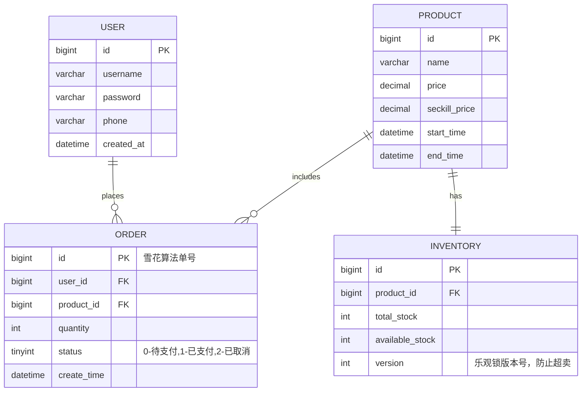

# 🛒 高并发秒杀系统 (分布式软件原理与技术项目)

## 📖 项目简介
本项目是一个基于微服务架构设计的高并发秒杀系统后端实现，为《分布式软件原理与技术》课程的个人核心项目。系统核心目标是应对瞬时高并发流量，保证数据一致性和系统稳定性。项目严格按照课程设计要求，拆分为**用户、商品、库存、订单**四个核心微服务，并整合了分布式缓存、消息队列等中间件来应对秒杀场景下的技术挑战。

---

## 🛠 技术栈概述
- **编程语言**：Java 21 (OpenJDK Temurin LTS)
- **开发工具**：Visual Studio Code
- **核心框架**：Spring Boot 3.2.x, Spring Cloud
- **持久层框架**：MyBatis-Plus
- **数据库**：MySQL 8.0 (部署于阿里云云数据库 RDS)
- **项目构建工具**：Apache Maven 3.9+
- **版本控制**：Git

---

## 🏛 一、 系统架构设计

本项目采用经典的分层微服务架构，利用中间件实现流量削峰和数据缓存，极致保护后端数据库。

### 1. 架构草图
*(下图展示了本系统的核心请求流转与微服务拆分架构)*

 
> *注：如图片无法显示，请参考下方核心链路文字说明。*

### 2. 核心请求链路说明
1. **客户端层：** 用户通过 Web浏览器 / App / 小程序 发起秒杀请求。
2. **接入层 (API Gateway)：** 负责请求的统一接入、路由转发、身份鉴权以及基础的限流（如单 IP 限流）。
3. **微服务层 (核心业务处理)：** 系统拆分为四个独立的服务，互相通过 RESTful API 或 RPC 调用：
   - `User-Service (用户服务)`：负责处理用户注册、登录鉴权、Token 生成。
   - `Product-Service (商品服务)`：负责秒杀商品列表展示、商品详情查询（结合缓存缓解数据库压力）。
   - `Inventory-Service (库存服务)`：**核心服务**，负责处理扣减库存的业务逻辑（优先在 Redis 预扣减）。
   - `Order-Service (订单服务)`：负责生成秒杀成功的最终订单记录。
4. **中间件层 (高并发防护)：**
   - **Redis 缓存：** 用于抗住海量并发读请求（商品信息预热），以及利用 Lua 脚本进行高效的分布式库存预扣减，防止超卖。
   - **消息队列 (RabbitMQ)：** 采用异步削峰填谷的思想，写请求异步落库。秒杀成功后发送下单消息，订单服务异步消费消息落库，保护 MySQL。
5. **数据层：** 采用阿里云云数据库 RDS (MySQL) `seckill_db` 进行数据的最终持久化落地。

---

## 🔌 二、 各服务 API 接口定义 (RESTful 规范)

本项目严格遵循 RESTful 规范，将资源实体作为 URI 核心，使用 HTTP 动词区分操作行为。

### 用户服务 (User Service)
| 方法 | 接口路径 | 功能描述 |
| :--- | :--- | :--- |
| `POST` | `/api/users/register` | 用户注册 |
| `POST` | `/api/users/login` | 用户登录并获取 JWT Token |
| `GET`  | `/api/users/{id}` | 获取指定用户信息 |

### 商品服务 (Product Service)
| 方法 | 接口路径 | 功能描述 |
| :--- | :--- | :--- |
| `GET`  | `/api/products` | 获取可参与秒杀的商品列表 |
| `GET`  | `/api/products/{id}` | 获取单个秒杀商品详情 |

### 库存服务 (Inventory Service)
| 方法 | 接口路径 | 功能描述 |
| :--- | :--- | :--- |
| `GET`  | `/api/inventory/{productId}` | 查询商品实时剩余库存 |
| `PUT`  | `/api/inventory/{productId}/deduct`| 扣减指定商品的库存（内部调用/秒杀动作触发） |

### 订单服务 (Order Service)
| 方法 | 接口路径 | 功能描述 |
| :--- | :--- | :--- |
| `POST` | `/api/orders/seckill` | **【核心】执行秒杀下单**（需携带商品ID与用户Token） |
| `GET`  | `/api/orders/{id}` | 根据单号查询订单详情 |
| `GET`  | `/api/orders/user/{userId}` | 查询某用户的所有秒杀订单记录 |

---

## 🗄️ 三、 数据库 ER 图与表结构设计

本项目基于阿里云 RDS 建立 `seckill_db` 数据库。

### 1. 实体关系图 (ER 图)




### 2. 核心关系说明
- `用户` (1) ——产生——> (N) `订单`：一对多关系。
- `商品` (1) ——被包含——> (N) `订单`：一对多关系。
- `商品` (1) ——对应——> (1) `库存`：一对一拆分，保证微服务职责单一。

---

## 💻 四、 技术栈选型详细说明

结合目前业界主流微服务架构及本地开发环境，本项目技术栈敲定如下，并已成功完成基础环境搭建与验证：

1. **编程语言：Java 21 (OpenJDK Temurin)**
   - **选型亮点：** 采用目前最新的 LTS（长期支持）版本，**核心亮点在于引入了虚拟线程 (Virtual Threads)**。在秒杀场景下，系统面临海量网络 I/O 等待（如查数据库、调 Redis），传统 Tomcat 平台线程极易耗尽。虚拟线程极为轻量，**在不增加硬件服务器配置的前提下，能极大提升秒杀核心接口的并发吞吐量 (QPS)**。目前已在本地开发环境中成功跑通验证 (`VirtualThread[#57,tomcat-handler-0]`)。
2. **开发工具：Visual Studio Code (VS Code)**
   - **选型理由：** 配合 Extension Pack for Java 与 Spring Boot Extension Pack 插件，提供轻量且响应迅速的现代微服务开发体验。
3. **应用框架：Spring Boot 3.2.x & Spring Cloud**
   - **选型理由：** Spring Boot 3 完美兼容 Java 21，原生支持开启虚拟线程特性。通过 Spring Cloud 体系可方便地实现四大微服务的拆分、服务注册发现以及路由转发。
4. **持久层框架：MyBatis-Plus**
   - **选型理由：** 在国内拥有极高的生态普及度，极大简化单表 CRUD 开发工作量，配合自定义 SQL 亦能很好地处理复杂的秒杀行级锁（乐观锁）操作。
5. **数据库：MySQL 8.0 (部署于阿里云 RDS)**
   - **选型理由：** 成熟稳定的关系型数据库。已在阿里云创建 `seckill_db` 实例，提供云端高可用架构与自动备份恢复能力，保障订单、资产等核心数据万无一失。
6. **核心中间件 (进阶架构必选)：**
   - **Redis（分布式缓存）：** 秒杀系统的“防弹衣”。用于承接页面高频读请求，并通过 Lua 脚本实现原子级别的预扣库存，彻底防止“超卖”。
   - **RabbitMQ（消息队列）：** 用于秒杀业务的异步解耦与“削峰填谷”。抢单成功后立刻向 MQ 发送消息并返回用户排队中，订单服务在后台根据 MySQL 的写入能力平滑消费，防止数据库被打挂。

---

## 🚀 五、 后续开发计划
1. **服务拆分细化**：完成公共模块抽取，搭建完整的服务注册与发现中心（Nacos/Eureka）。
2. **接口联调**：使用 OpenFeign 实现微服务间的 RPC 内部调用。
3. **中间件集成**：完成 Redis 缓存防击穿处理，编写 Lua 脚本完成并发扣减库存逻辑；集成 RabbitMQ 队列。
4. **压力测试**：开发完成后，使用 JMeter 针对核心秒杀接口进行高并发压测，对比传统线程与 Java 21 虚拟线程的性能差异，验证系统整体抗压能力。
```
